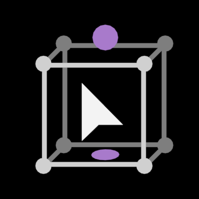

# 概述

PlaceHelper，即放置助手，提供了在blender中直观的快速摆放物体的方式

其主要功能为三个工具架工具：

+ 放置：提供单个物体的吸附放置，并带有基于底部中心的旋转/缩放的控件
+ 移动Pro：和原生移动工具功能一致，但添加了复制（物体模式）和挤出的功能（编辑模式）
+ 动态放置：基于blender物理模拟的多物体放置，提供多种模式

# 安装

下载提供的`.zip`文件，编辑>偏好设置>插件>安装，选中该`.zip`文件并确定

# 使用

## 放置工具

> 注：此工具主要作用于网格，曲线，字体，晶格的物体模式，其他物体无碰撞属性

#### 快速开始

1. 从左侧工具架中选中放置工具，并视图中单击**选中一个网格物体**，物体上将会出现两个紫色的控件
2. 将鼠标移动至网格物体上，左键点击并拖动，物体将随鼠标移动
3. 新建一个球体，并**只选中网格物体**，左键点击并拖动到球体上，网格物体的底部将会吸附在球体上
4. 左键点击并**左右拖动**紫色环形控件，网格物体将绕着物体局部z轴旋转
5. 左键点击并**上下拖动**紫色球形，网格物体将以其局部z轴最低点（步骤3的吸附点）放大/缩小
6. 按住alt并单击物体，此时应该出现五个黄色的箭头控件，点击其中的一个以切换吸附轴向。若不想切换，可以再次按住alt并单击物体以取消
7. 按住shift后，执行步骤2、3、4、5中的任意操作，操作将作用于复制的新物体上

#### 工具参数

+ 坐标系

  + 表面：物体的旋转发生变化，物体将沿着所选轴向吸附在其他物体表面
  + 默认：物体的旋转不会发生变化

+ 轴向

  + 吸附于物体表面时，朝向吸附表面上方的轴向

+ 反转轴

  + 若轴向为z，反转后将吸附物体顶部而不是底部

+ 复制

  + 实例：shift操作时，复制操作的物体将会是原物体的实例（网格数据关联）
  + 物体：shift操作时，复制操作的物体将会是完全复制物体（新的网格数据）

+ 设置（小齿轮图标）

  性能

  + 最终：评估网格碰撞盒将计算网格的形态键，修改器
  + 基础：只计算基础网格（编辑模式的网格）

  碰撞

  + 碰撞时停止（实验性）：操作物体与其他物体碰撞时候，操作将无法进行
  + 碰撞时不改变颜色：操作物体与其他物体碰撞时候，颜色将不会变红

#### 偏好设置

边界框

+ 几何偏移：防止完全接触进行的偏移
+ 显示
  + 碰撞警告：与其他物体边界框重叠时候变色
  + 宽度：边界框线条宽度
  + 颜色：默认颜色
  + 碰撞：碰撞时的颜色

Gizmo

+ 大小设置
+ 颜色设置

## 移动Pro

> 注：此工具作用于物体模式与网格的编辑模式

#### 快速开始

1. 从左侧工具架中选中工具，并视图中单击**选中一个物体**，物体上将会出现移动控件控件
1. 按住shift并拖动控件，可以复制并移动新的物体
1. 选中网格物体，在编辑模式下选中该工具，按住shift并拖动控件，可以实现挤出操作

**该工具受变换坐标系/变换轴心点控制**

#### 工具参数

+ 复制（仅物体模式）

  + 实例：shift操作时，复制操作的物体将会是原物体的实例（网格数据关联）

  + 物体：shift操作时，复制操作的物体将会是完全复制物体（新的网格数据）dong

## 动态放置

> 注：此工具作用于网格物体的物体模式

#### 快速开始

1. 从左侧工具架中选中工具，并在视图中选中一些网格物体，物体中心将出现六轴移动控件
2. 拖动任意控件，物体将往此方向发生移动模拟，停止拖动时，运动不再继续，持续拖动则继续模拟。松开左键，则模拟结束
3. 拖动一段距离后，按住ctrl进行拖动，则物体反向模拟运动
4. 拖动时按住shift可减慢模拟速度
5. 左上角切换位置为游标并尝试
6. 左上角切换工具模式为缩放（位置为中心），此时应该能看到三个缩放控件与一个白色的圆形控件

**该工具轴向目前只匹配全局坐标（但控件轴向与变换坐标系相匹配）**

#### 工具参数

+ 模式
  + 拖拽：多个物体朝着操作轴方向移动
  + 缩放：多个物体朝物体中心移动
  
+ 位置*(游标模式还有bug)*
  + 中心：力将出现在物体中心
  + 游标：力将出现在游标处

+ 重力（拖拽模式）: 加速度
  
+ 强度（缩放模式）：力的强度

+ 设置（小齿轮图标）

  碰撞

  + 活动项：计算方式

  + 被动项：计算方式

  + 边距：碰撞边距

  + **追溯父级集合深度**

    追溯父级集合下的网格物体用于碰撞，例如

    + 值为1时：仅将选中物体所在集合的子物体作为被动项碰撞
    + 值为2时(默认)：将选中物体所在集合的所有父集合下的子物体作为被动项碰撞

    
    
#### 偏好设置

运行时变色：运行时候切换物体颜色方便观察