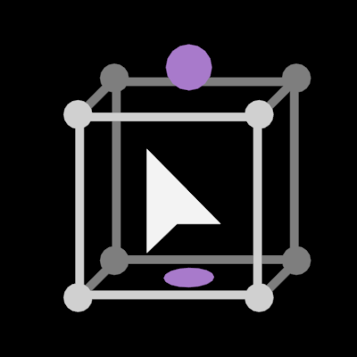

# 放置工具

> 注：此工具主要作用于网格，曲线，字体，晶格的物体模式，其他物体无碰撞属性

### 快速开始

1. 从左侧工具架中选中放置工具，并视图中单击**选中一个网格物体**，物体上将会出现两个紫色的控件
2. 将鼠标移动至网格物体上，左键点击并拖动，物体将随鼠标移动
3. 新建一个球体，并**只选中网格物体**，左键点击并拖动到球体上，网格物体的底部将会吸附在球体上
4. 左键点击并**左右拖动**紫色环形控件，网格物体将绕着物体局部z轴旋转
5. 左键点击并**上下拖动**紫色球形，网格物体将以其局部z轴最低点（步骤3的吸附点）放大/缩小
6. 按住alt并单击物体，此时应该出现五个黄色的箭头控件，点击其中的一个以切换吸附轴向。若不想切换，可以再次按住alt并单击物体以取消
7. 按住shift后，执行步骤2、3、4、5中的任意操作，操作将作用于复制的新物体上

### 工具参数

+ 坐标系

  + 表面：物体的旋转发生变化，物体将沿着所选轴向吸附在其他物体表面
  + 默认：物体的旋转不会发生变化

+ 轴向

  + 吸附于物体表面时，朝向吸附表面上方的轴向

+ 反转轴

  + 若轴向为z，反转后将吸附物体顶部而不是底部

+ 复制

  + 实例：shift操作时，复制操作的物体将会是原物体的实例（网格数据关联）
  + 物体：shift操作时，复制操作的物体将会是完全复制物体（新的网格数据）

+ 设置（小齿轮图标）

  性能

  + 最终：评估网格碰撞盒将计算网格的形态键，修改器
  + 基础：只计算基础网格（编辑模式的网格）

  碰撞

  + 碰撞时停止（实验性）：操作物体与其他物体碰撞时候，操作将无法进行
  + 碰撞时不改变颜色：操作物体与其他物体碰撞时候，颜色将不会变红